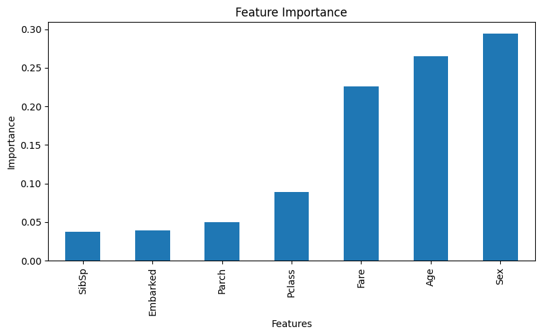

# 🛳 Titanic Survival Prediction

A beginner machine learning project to predict passenger survival using the Titanic dataset from Kaggle.

## 🔧 Tools Used
- Python
- Pandas, NumPy
- Seaborn, Matplotlib
- scikit-learn

## 📊 Steps
- Data cleaning and EDA
- Feature encoding
- Model training (Decision Tree)
- Evaluation and accuracy score
- Feature importance analysis

## ✅ Accuracy
Achieved ~75% accuracy on test data.

## 📁 Project Structure

titanic-ml-classifier/
├── notebooks/
│ └── titanic.ipynb # Full notebook with code
├── requirements.txt # Libraries used
└── README.md


## 🖼 Sample Output



## 🚀 How to Run

```bash
git clone https://github.com/fhoseini97/titanic-ml-classifier.git
cd titanic-ml-classifier
pip install -r requirements.txt
